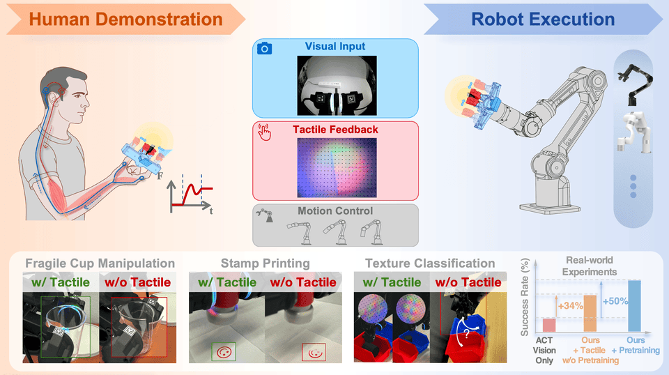

# FreeTacMan: Robot-free Visuo-Tactile Data Collection System
🔗https://freetacmanblog.github.io/

<!-- 
FreeTacMan is a robot-free, human-centric visuo-tactile
data collection system, featuring low-cost, high-resolution tactile sensors and a portable, cross-embodiment 
modular design. FreeTacMan transfers human visual perception, tactile sensing, and
motion control skills to robots efficiently by integrating visual and tactile data. -->

## ⭐ Overview



<!-- We introduce FreeTacMan, a human-centric and robot-free data collection system for accurate and efficient robot manipulation. Concretely, we design a wearable data collection device with dual visuo-tactile grippers, which can be worn by human fingers for intuitive and natural control. A high-precision optical tracking system is introduced to capture end-effector poses while synchronizing visual and tactile feedback simultaneously. FreeTacMan achieves multiple improvements in data collection performance compared to prior works, and enables effective policy learning for contact-rich manipulation tasks with the help of the visuo-tactile information.  -->

🚀 [Demo Page](https://freetacmanblog.github.io/) | 📄 [Paper](https://arxiv.org/abs/XXXX.XXXXX) | 🛠️ [Hardware Guide](https://docs.google.com/document/d/1Hhi2stn_goXUHdYi7461w10AJbzQDC0fdYaSxMdMVXM/edit?addon_store&tab=t.0#heading=h.rl14j3i7oz0t)

✒️ Longyan Wu*, Checheng Yu*, Jieji Ren*, Li Chen, Ran Huang, Guoying Gu, Hongyang Li

📧 Primary Contact: Longyan Wu (im.longyanwu@gmail.com)
💼 Joint effort by Shanghai Innovation Institute, The University of Hong Kong, and Shanghai Jiao Tong University

## 🦾 Highlights
- **Visuo-Tactile Sensor**: A high-resolution, low-cost visuo-tactile sensor designed for rapid adaptation across multiple robotic end-effectors. 
- **Data-collection System**: An in-situ, robot-free, real-time tactile data-collection system to excel at diverse tasks efficiently.
- **Policy Learning Enhanced by Tactile Pretraining**: Imitation policies trained with our visuo-tactile data outperform vision-only baselines by 50% on average.
<!-- in a wide spectrum of contact-rich manipulation tasks. -->

## Table of Contents
- [Overview](#overview)
- [Highlights](#highlights)
- [Getting Started](#getting-started)
  - [Installation](#installation)
  - [Hardware Assembly](#hardware-assembly)
  - [Data Collection](#data-collection)
  - [Data Processing](#data-processing)
  - [Training](#training)
  - [Inference](#inference)
- [Citation](#citation)
- [Acknowledgements](#acknowledgements)
- [License](#license)

<!-- ## 🎥 Demo

### User Study

 Fragile Cup | USB Plug | Texture Classification | Stamp Press | Calligraphy | Potato Chip | Tissue | Toothpaste |
|:-----------:|:--------:|:---------------------:|:-----------:|:-----------:|:-----------:|:------:|:----------:|
| <video src="video/user_study/FragileCupManipulation.mp4" width="200" controls></video> | <video src="video/user_study/USBPlugging.mp4" width="200" controls></video> | <video src="video/user_study/TextureClassification.mov" width="200" controls></video> | <video src="video/user_study/StampPressing.mp4" width="200" controls></video> | <video src="video/user_study/CalligraphyWriting.mov" width="200" controls></video> | <video src="video/user_study/PotatoChipGrasping.mp4" width="200" controls></video> | <video src="video/user_study/TissueGrasping.mp4" width="200" controls></video> | <video src="video/user_study/ToothpasteExtrusion.mp4" width="200" controls></video> |

### Policy Rollouts
(TODO: add video)

| Fragile Cup | USB Plug | Texture Classification | Stamp Press | Calligraphy |
|:-----------:|:--------:|:---------------------:|:-----------:|:-----------:|
| <video src="video/policy_rollouts/FragileCupManipulation.mov" width="200" controls></video> | <video src="video/policy_rollouts/USBPlugging.mov" width="200" controls></video> | <video src="video/policy_rollouts/TextureClassification.mp4" width="200" controls></video> | <video src="video/policy_rollouts/StampPressing.mov" width="200" controls></video> | <video src="video/policy_rollouts/CalligraphyWriting.mp4" width="200" controls></video> | -->

<!-- ## 🚀 FreeTacMan's Performance

### User Study

*Figure 1: User study results comparing FreeTacMan with ALOHA and UMI across different metrics. FreeTacMan demonstrates superior performance in completion rate, collection efficiency, and CPUT score per task, while also excelling in user experience evaluation including control accuracy, ease of collection procedure, and stability.*

### Policy Rollouts
| Method | Fragile Cup | USB Plug | Texture Cls. | Stamp Press | Calligraphy | **Avg.** |
|:-------|:-----------:|:--------:|:------------:|:-----------:|:-----------:|:--------:|
| ACT (Vision-only) | 35 | 0 | 20 | 20 | 30 | **21** |
| Ours (+ Tactile w/o Pretraining) | 75 | 10 | 70 | 55 | 65 | **55** |
| Ours (+ Pretraining) | **80** | **20** | **90** | **85** | **80** | **71** |

*Table 3: Policy success rates (%) across contact-rich tasks. The visuo-tactile information, together with the pretraining strategy, greatly helps imitation learning for the contact-rich tasks.* -->

## 🎮 Getting Started

### Installation

#### Requirements

- Python 3.7+
- PyTorch 1.9+ (or compatible)
- CUDA 11.0+ (for GPU support)
- [Other dependencies](requirement.txt)

#### Clone the Repository

```bash
git clone https://github.com/yourusername/FreeTacMan.git
cd FreeTacMan
```

#### Install Dependencies

```bash
# Create a new conda environment (recommended)
conda create -n freetacman python=3.8
conda activate freetacman

# Install PyTorch (adjust version according to your CUDA version)
conda install pytorch torchvision torchaudio pytorch-cuda=11.8 -c pytorch -c nvidia

# Install other dependencies
pip install -r requirements.txt
```

### Hardware Assembly

For detailed hardware assembly instructions, please refer to our 🛠️ [Hardware Guide](https://docs.google.com/document/d/1Hhi2stn_goXUHdYi7461w10AJbzQDC0fdYaSxMdMVXM/edit?addon_store&tab=t.0#heading=h.rl14j3i7oz0t).

<!-- ```bash
# Download 3D models
cd hardware/3d_models

# Print the parts using your 3D printer
``` -->

### Data Collection
1. **Set up Environment**
   ```bash
   # Test the sensors and OptiTrack tracking system
   python data_collection/test_collection.py
   ```

2. **Start Collection**
   ```bash
   # Start data collection
   python data_collection/start_collect.py
   ```
   After the collection, all the raw data of current task will be saved to ```dataset/raw/task_name```.

### Data Processing
Before starting to process your collected raw data, you need to place your robot URDF file into ```asset```, and modify the configurations in ```data_collection/config.json```.
```bash
# Process collected data
python scripts/process_data.py
```
After the data processing, the raw data will be processed to hdf5 files which are available for pretrain and policy training, saved in ```dataset/processed/task_name```. 


### Training
1. **Pretraining**
   Before starting to pretrain your tactile encoder, please check your dataset path (processed) and model saving path in ```pretrain/train_clip_resnet.sh```.
   ```bash
   # Start pretraining by running sh file
   bash pretrain/train_clip_resnet.sh
   # Or directly run the Python file
   python pretrain/clip_pretraining.py \
         --dataset_dir /path/to/your/dataset \
         --save_dir /path/to/your/checkpoint \
         --num_episodes 1000 \
         --batch_size 45 \
         --n_clip_images 5 \
         --min_distance 20 \
         --n_epochs 5000 \
   ```
3. **Policy Training**
   Before starting to train your ACT policy, please check your task dataset (processed) and other training parameters in ```policy/aloha-devel/train.sh```.
   
   ```bash
   # Start pretraining
   bash policy/aloha-devel/train.sh
   # Or directly run the Python file
   python policy/aloha-devel/act/train.py \
         --dataset_dir $dataset_dir \
         --ckpt_dir $save_dir \
         --num_episodes $num_episodes \
         --batch_size $batch_size \
         --num_epochs $num_epochs \
         --task_name $task \
         --policy_class ACT \
         --chunk_size $chunk_size \
         --use_tactile_image true \
         --pretrained_tactile_backbone true \
         --tactile_backbone_path /path/to/your/pretrain/checkpoint

   ```

### Inference
   ```bash
   # Run inference on new data
   python scripts/inference.py \
      --batch_size $batch_size \
      --task_name $task \
      --policy_class ACT \
      --ckpt_dir $save_dir \
      --use_tactile_image true \
      --pretrained_tactile_backbone true \
      --tactile_backbone_path /path/to/your/pretrain/checkpoint

   ```

## 📝 Citation

If you find our work useful in your research, please consider citing our paper:

```bibtex
@article{wu2024freetacman,
  title={FreeTacMan: Robot-free Visuo-Tactile Data Collection System},
  author={Wu, Longyan and Yu, Checheng and Ren, Jieji and Chen, Li and Huang, Ran and Gu, Guoying and Li, Hongyang},
  journal={arXiv preprint arXiv:XXXX.XXXXX},
  year={2025}
}
```

## 🙏 Acknowledgements

We would like to thank:
- Huijie Wang for developing the demonstration page
- Zherui Qiu for helping organize and supervise the user study
- Yixuan Pan, Qingwen Bu, Zhuoheng Li, Jisong Cai, Yuxiang Lu, and Ningbin Zhang for their valuable insights and constructive discussions
- Zhirui Zhang, Xinyu Yang, Fengjie Shen, Huang Taoyuan, and Lekai Chen for their assistance during the experiments
- All user study participants for their valuable feedback

## 📄 License

This project is under the [Apache 2.0 License](LICENSE) unless specified otherwise.
