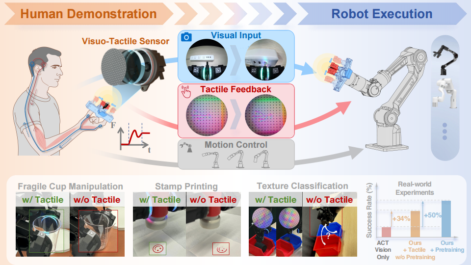
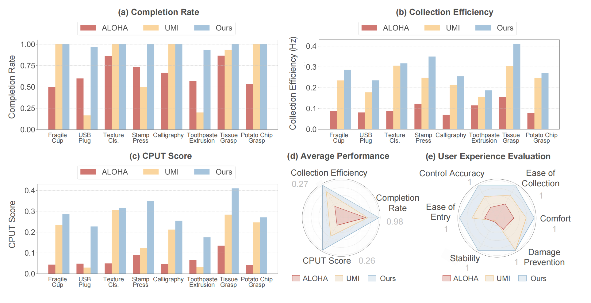

# FreeTacMan: Robot-free Visuo-Tactile Data Collection System

FreeTacMan is a robot-free, human-centric visuo-tactile
data collection system, featuring low-cost, high-resolution tactile sensors and a portable, cross-embodiment modular design. FreeTacMan transfers human visual perception, tactile sensing, and
motion control skills to robots efficiently by integrating visual and tactile data.

## Table of Contents
- [Overview](#overview)
- [Features](#features)
- [Installation](#installation)
- [Usage](#usage)
- [Training](#training)
- [Experiments](#experiments)
- [Contributing](#contributing)
- [License](#license)

## Overview



We introduce FreeTacMan, a human-centric and robot-free data collection system for accurate and efficient robot manipulation. Concretely, we design a wearable data collection device with dual visuo-tactile grippers, which can be worn by human fingers for intuitive and natural control. A high-precision optical tracking system is introduced to capture end-effector poses while synchronizing visual and tactile feedback simultaneously. FreeTacMan achieves multiple improvements in data collection performance compared to prior works, and enables effective policy learning for contact-rich manipulation tasks with the help of the visuo-tactile information. 

📄 [Paper](https://arxiv.org/abs/XXXX.XXXXX) | 🚀 [Demo Page](https://freetacman.github.io) | 🛠️ [Hardware Guide](https://docs.google.com/document/d/1Hhi2stn_goXUHdYi7461w10AJbzQDC0fdYaSxMdMVXM/edit?addon_store&tab=t.0#heading=h.rl14j3i7oz0t)

✒️ Longyan Wu, Checheng Yu, Jieji Ren, Li Chen, Ran Huang, Guoying Gu, Hongyang Li

📧 Primary Contact: Longyan Wu (im.longyanwu@gmail.com)

## 🦾 Highlights
- **Visuo-Tactile Hardware Sensor Design**: A portable, high-resolution, low-cost visuo-tactile hardware sensor designed for rapid adaptation across multiple robotic end-effectors. 
- **Tactile Data-collection System**: An in-situ, robot-free, real-time tactile data-collection system that leverages a handheld end effector and the proposed sensor to excel at diverse contact-rich tasks efficiently.
- **Policy Learning Enhanced by Tactile Pretraining**: Experimental validation shows that imitation policies trained with our visuo-tactile data achieve an average 50% higher success rate than vision-only approaches in a wide spectrum of contact-rich manipulation tasks.

## 🎥 Demo

Policy Rollouts

User Study

## 🚀 FreeTacMan's Performance
Policy Rollouts

User Study

## 🎮 Getting Started
## Installation

### Requirements

- Python 3.7+
- PyTorch 1.9+ (or compatible)
- CUDA 11.0+ (for GPU support)
- [Other dependencies](requirements.txt)

### Clone the Repository

```bash
git clone https://github.com/yourusername/FreeTacMan.git
cd FreeTacMan

