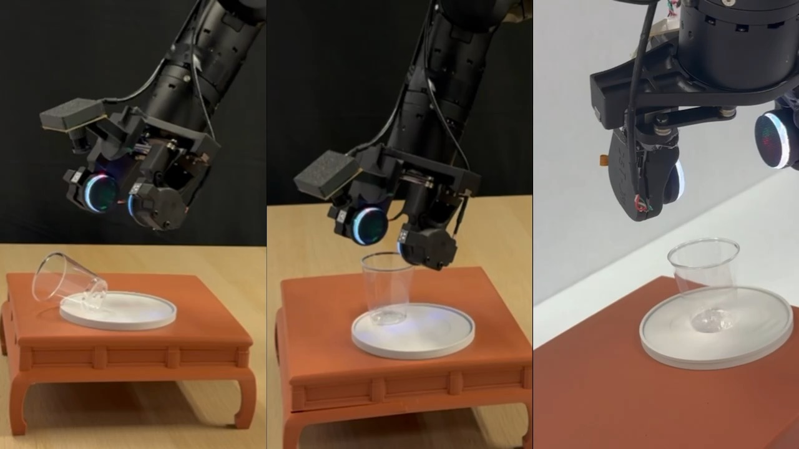
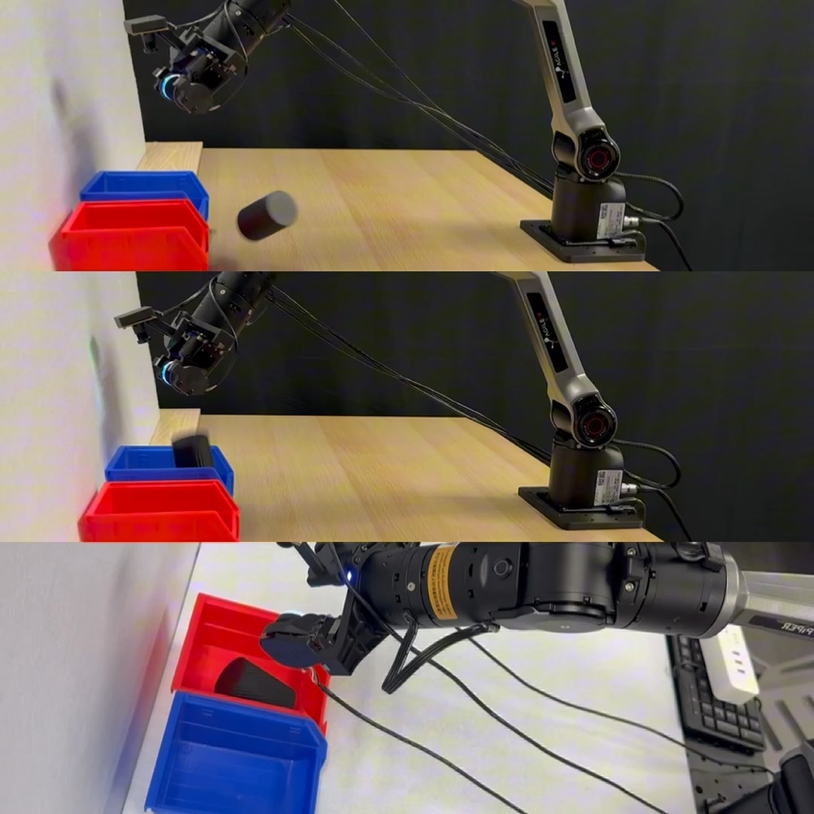
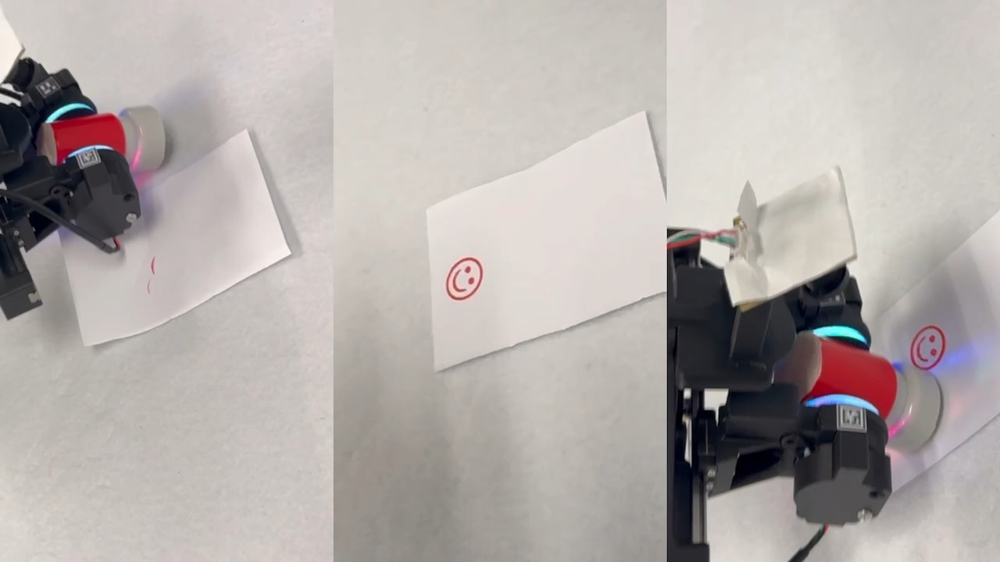
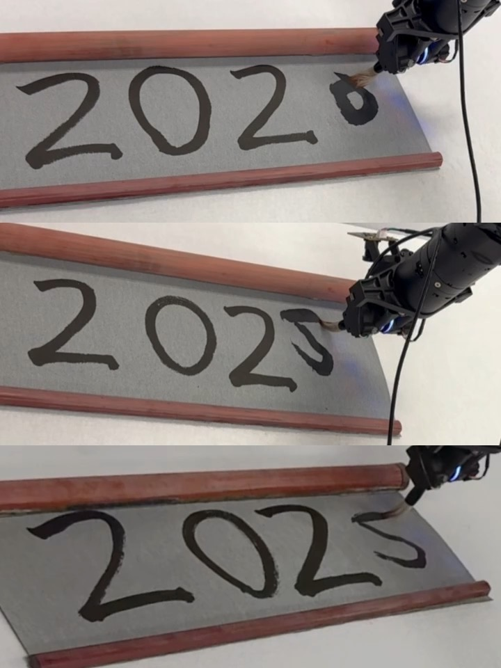

# FreeTacMan: Robot-free Visuo-Tactile Data Collection System

FreeTacMan is a robot-free, human-centric visuo-tactile
data collection system, featuring low-cost, high-resolution tactile sensors and a portable, cross-embodiment modular design. FreeTacMan transfers human visual perception, tactile sensing, and
motion control skills to robots efficiently by integrating visual and tactile data.

## Table of Contents
- [Overview](#overview)
- [Highlights](#highlights)
- [Demo](#demo)
- [FreeTacMan's Performance](#freetacmans-performance)
- [Getting Started](#getting-started)
  - [Installation](#installation)
    - [Requirements](#requirements)
    - [Clone the Repository](#clone-the-repository)

## ⭐ Overview


We introduce FreeTacMan, a human-centric and robot-free data collection system for accurate and efficient robot manipulation. Concretely, we design a wearable data collection device with dual visuo-tactile grippers, which can be worn by human fingers for intuitive and natural control. A high-precision optical tracking system is introduced to capture end-effector poses while synchronizing visual and tactile feedback simultaneously. FreeTacMan achieves multiple improvements in data collection performance compared to prior works, and enables effective policy learning for contact-rich manipulation tasks with the help of the visuo-tactile information. 

📄 [Paper](https://arxiv.org/abs/XXXX.XXXXX) | 🚀 [Demo Page](https://freetacman.github.io) | 🛠️ [Hardware Guide](https://docs.google.com/document/d/1Hhi2stn_goXUHdYi7461w10AJbzQDC0fdYaSxMdMVXM/edit?addon_store&tab=t.0#heading=h.rl14j3i7oz0t)

✒️ Longyan Wu*, Checheng Yu*, Jieji Ren*, Li Chen, Ran Huang, Guoying Gu, Hongyang Li

📧 Primary Contact: Longyan Wu (im.longyanwu@gmail.com)

## 🦾 Highlights
- **Visuo-Tactile Hardware Sensor Design**: A portable, high-resolution, low-cost visuo-tactile hardware sensor designed for rapid adaptation across multiple robotic end-effectors. 
- **Tactile Data-collection System**: An in-situ, robot-free, real-time tactile data-collection system that leverages a handheld end effector and the proposed sensor to excel at diverse contact-rich tasks efficiently.
- **Policy Learning Enhanced by Tactile Pretraining**: Experimental validation shows that imitation policies trained with our visuo-tactile data achieve an average 50% higher success rate than vision-only approaches in a wide spectrum of contact-rich manipulation tasks.

## 🎥 Demo

### Policy Rollouts

| Fragile Cup | USB Plug | Texture Classification | Stamp Press | Calligraphy |
|:-----------:|:--------:|:---------------------:|:-----------:|:-----------:|
| [](video/policy_rollouts/FragileCupManipulation.mov) | [](video/policy_rollouts/USBPlugging.mov) | [](video/policy_rollouts/TextureClassification.mp4) | [](video/policy_rollouts/StampPressing.mov) | [](video/policy_rollouts/CalligraphyWriting.mp4) |

### User Study

| Fragile Cup | USB Plug | Texture Classification | Stamp Press | Calligraphy | Potato Chip | Tissue | Toothpaste |
|:-----------:|:--------:|:---------------------:|:-----------:|:-----------:|:-----------:|:------:|:----------:|
| [](video/user_study/FragileCupManipulation.mp4) | [](video/user_study/USBPlugging.mp4) | [](video/user_study/TextureClassification.mov) | [](video/user_study/StampPressing.mp4) | [](video/user_study/CalligraphyWriting.mov) | [](video/user_study/PotatoChipGrasping.mp4) | [](video/user_study/TissueGrasping.mp4) | [](video/user_study/ToothpasteExtrusion.mp4) |

## 🚀 FreeTacMan's Performance
### Policy Rollouts

| Method | Fragile Cup | USB Plug | Texture Cls. | Stamp Press | Calligraphy | **Avg.** |
|:-------|:-----------:|:--------:|:------------:|:-----------:|:-----------:|:--------:|
| ACT (Vision-only) | 35 | 0 | 20 | 20 | 30 | **21** |
| Ours (+ Tactile w/o Pretraining) | 75 | 10 | 70 | 55 | 65 | **55** |
| Ours (+ Pretraining) | **80** | **20** | **90** | **85** | **80** | **71** |

*Table 1: Policy success rates (%) across contact-rich tasks. The visuo-tactile information, together with the pretraining strategy, greatly helps imitation learning for the contact-rich tasks.*

### User Study

## 🎮 Getting Started
## Installation

### Requirements

- Python 3.7+
- PyTorch 1.9+ (or compatible)
- CUDA 11.0+ (for GPU support)
- [Other dependencies](requirements.txt)

### Clone the Repository

```bash
git clone https://github.com/yourusername/FreeTacMan.git
cd FreeTacMan

